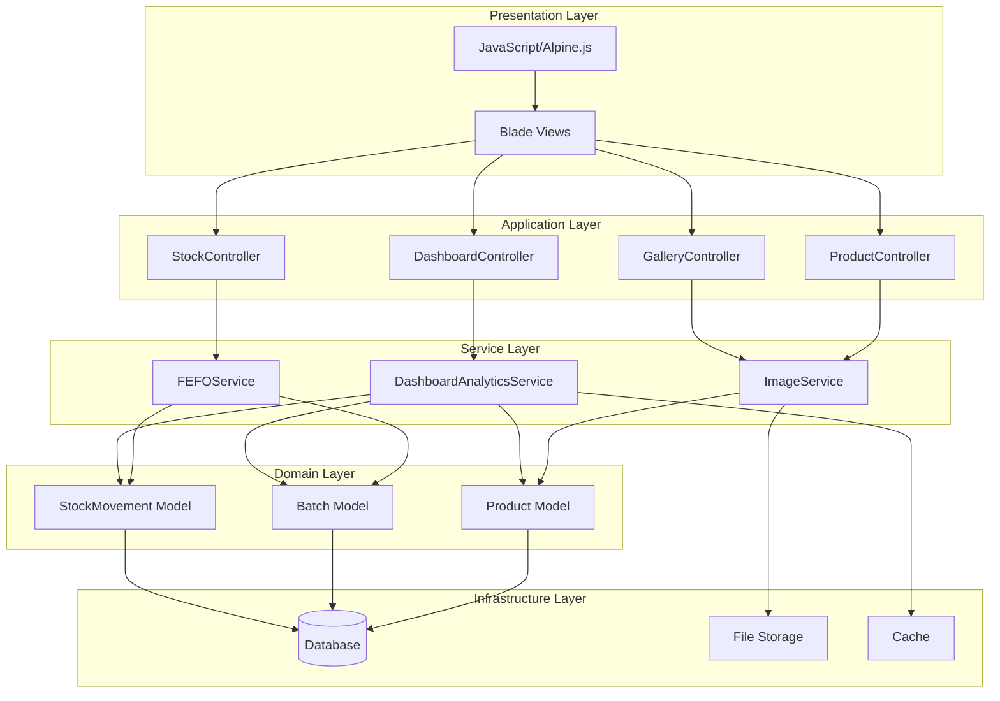
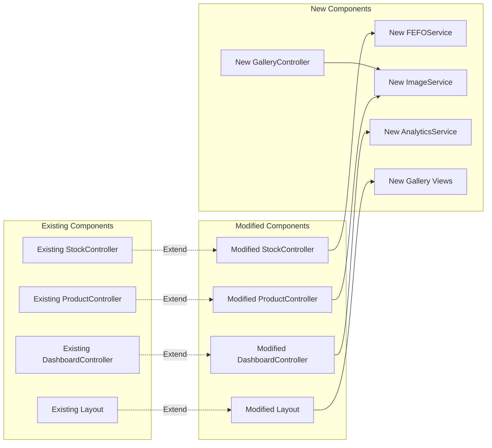
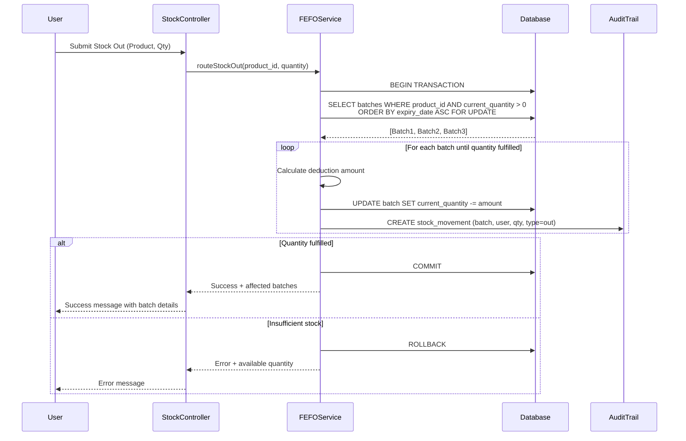
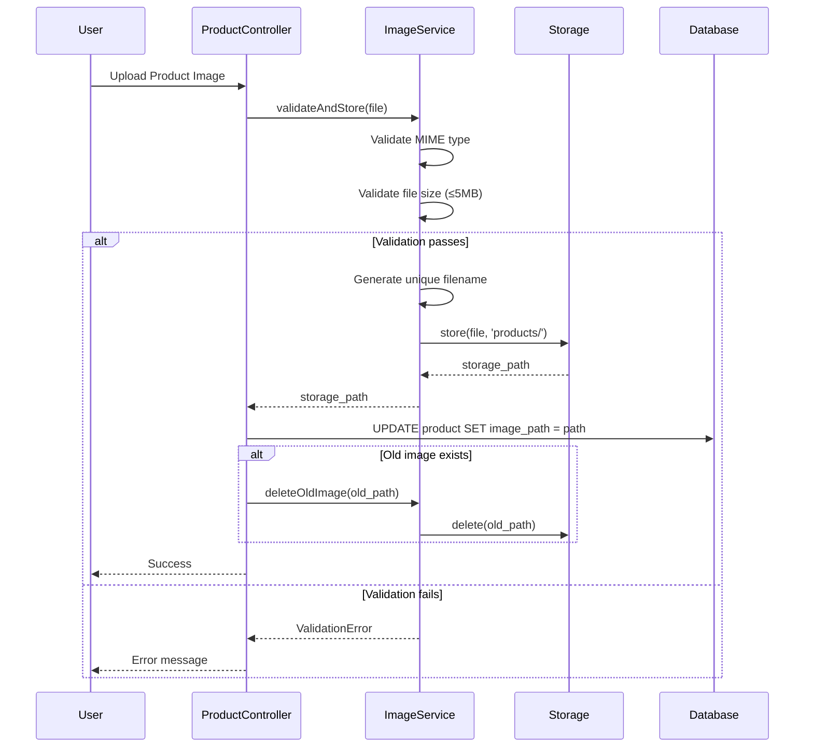
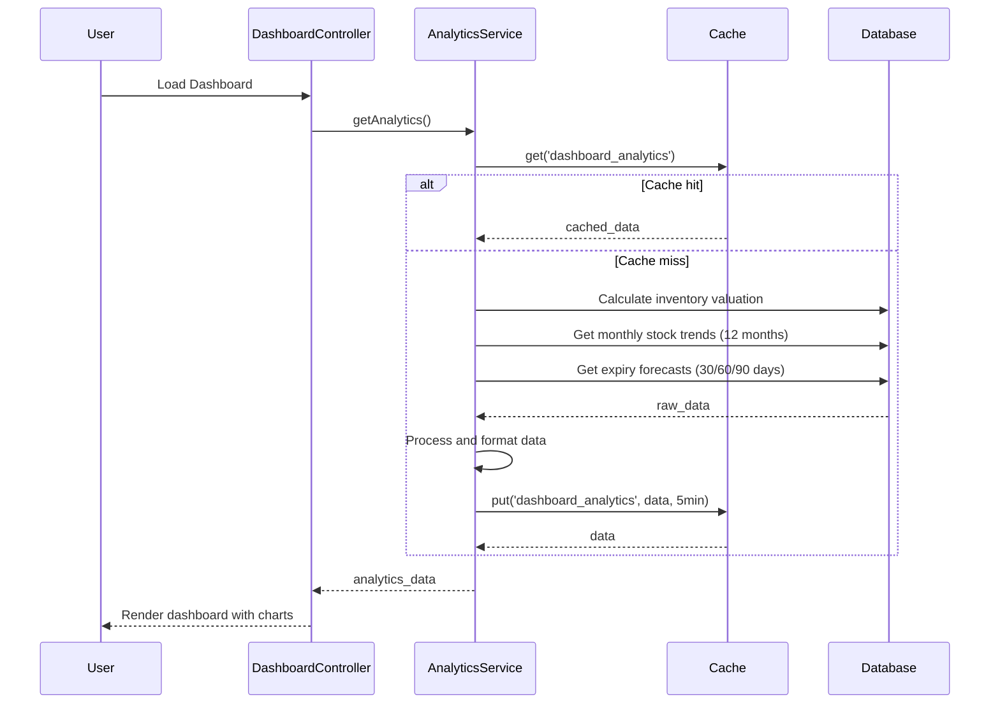
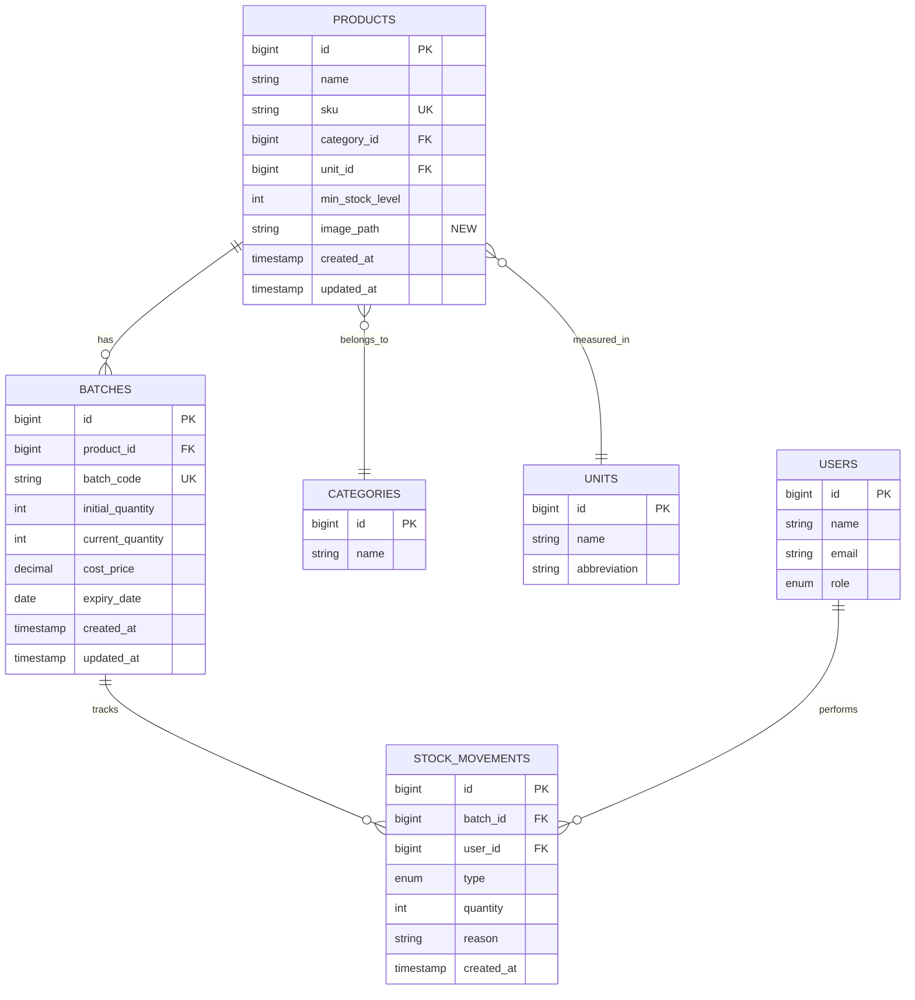

# Design Document: IT9 System Optimization & Feature Expansion

## Overview

This design document specifies the technical architecture and implementation strategy for optimizing and expanding The Ranch Farm Inventory Management System. The system follows a Product Blueprint vs Physical Stock paradigm where Products represent item templates and Batches represent physical inventory instances with expiry tracking.

### Design Goals

1. **Streamlined Navigation**: Consolidate related management interfaces under a unified Product Management view with tabbed sub-navigation
2. **Intelligent Stock Routing**: Implement FEFO (First-Expired, First-Out) logic to automatically select batches based on expiry dates
3. **Enhanced Analytics**: Provide comprehensive dashboard insights including inventory valuation, stock trends, and expiry forecasts
4. **Visual Product Catalog**: Enable image-based product browsing with quick-action capabilities

### System Context

The system is built on Laravel 11.x with:
- **Backend**: PHP 8.2+, Laravel Framework
- **Database**: SQLite (development), MySQL/PostgreSQL (production)
- **Frontend**: Blade templates, Tailwind CSS, Alpine.js/Vanilla JS
- **Storage**: Laravel Storage facade with local disk driver
- **Authentication**: Laravel Breeze with role-based access control (Admin, Manager, Staff)

### Key Architectural Principles

1. **Separation of Concerns**: Business logic in service classes, controllers handle HTTP concerns
2. **Database Transactions**: All multi-step operations wrapped in transactions with pessimistic locking
3. **Eager Loading**: Prevent N+1 queries through strategic relationship loading
4. **Caching Strategy**: Cache expensive calculations (dashboard analytics) for 5 minutes
5. **File Storage**: Use Laravel Storage facade for portable, testable file operations
6. **Progressive Enhancement**: Core functionality works without JavaScript, enhanced with JS


## Architecture

### High-Level System Architecture



### Component Integration Architecture



### Data Flow Architecture

#### FEFO Stock Out Flow



#### Image Upload Flow



#### Dashboard Analytics Flow




## Components and Interfaces

### Phase 1: Navigation Consolidation

#### Modified Component: `resources/views/layouts/farm_app.blade.php`

**Changes Required:**
- Rename "Products" sidebar link to "Product Management"
- Remove "Categories" sidebar link
- Remove "Units of Measure" sidebar link (keep for now, will be moved to sub-nav)
- Add route parameter to detect active tab

**Implementation:**
```php
// Sidebar navigation update
<a href="{{ route('products.index') }}" 
   class="flex items-center px-4 py-3 text-sm font-medium rounded-lg transition-all duration-200 
   {{ request()->routeIs('products.*') || request()->routeIs('categories.*') || request()->routeIs('units.*') 
      ? 'bg-blue-500 text-white shadow-md' 
      : 'text-gray-300 hover:bg-slate-700 hover:text-white' }}">
    <span class="mr-3 w-5 text-center">📦</span>
    <span>Product Management</span>
</a>
```

#### New Component: `resources/views/components/tab-navigation.blade.php`

**Purpose:** Reusable tabbed navigation component

**Props:**
- `tabs`: Array of tab definitions `[['name' => 'Products', 'route' => 'products.index', 'icon' => '📦'], ...]`
- `active`: Current active tab name

**Implementation:**
```blade
@props(['tabs', 'active'])

<div class="bg-white rounded-lg shadow-md mb-6">
    <nav class="flex border-b border-gray-200">
        @foreach($tabs as $tab)
            <a href="{{ route($tab['route']) }}" 
               class="flex items-center px-6 py-4 text-sm font-medium border-b-2 transition-all
                      {{ $active === $tab['name'] 
                         ? 'border-blue-500 text-blue-600' 
                         : 'border-transparent text-gray-500 hover:text-gray-700 hover:border-gray-300' }}">
                <span class="mr-2">{{ $tab['icon'] }}</span>
                {{ $tab['name'] }}
            </a>
        @endforeach
    </nav>
</div>
```

#### Modified Views:
- `resources/views/products/index.blade.php` - Add tab navigation
- `resources/views/categories/index.blade.php` - Add tab navigation
- `resources/views/units/index.blade.php` - Add tab navigation (if exists, otherwise use existing)

**Tab Configuration:**
```php
$tabs = [
    ['name' => 'Products', 'route' => 'products.index', 'icon' => '📦'],
    ['name' => 'Categories', 'route' => 'categories.index', 'icon' => '🏷️'],
    ['name' => 'Units', 'route' => 'units.index', 'icon' => '📏'],
];
```

### Phase 2: FEFO Stock Routing Engine

#### New Service: `app/Services/FEFOService.php`

**Purpose:** Encapsulate FEFO routing logic for reusability and testability

**Public Methods:**

```php
namespace App\Services;

use App\Models\Product;
use App\Models\Batch;
use App\Models\StockMovement;
use Illuminate\Support\Facades\DB;
use Illuminate\Support\Facades\Auth;

class FEFOService
{
    /**
     * Route stock out using FEFO logic
     * 
     * @param int $productId
     * @param int $quantity
     * @param string|null $reason
     * @return array ['success' => bool, 'message' => string, 'affected_batches' => array]
     * @throws \Exception
     */
    public function routeStockOut(int $productId, int $quantity, ?string $reason = null): array
    {
        return DB::transaction(function () use ($productId, $quantity, $reason) {
            // Get all active batches for this product, ordered by expiry date (FEFO)
            // Use lockForUpdate() for pessimistic locking
            $batches = Batch::where('product_id', $productId)
                ->where('current_quantity', '>', 0)
                ->orderBy('expiry_date', 'asc')
                ->orderBy('id', 'asc') // Tie-breaker for same expiry dates
                ->lockForUpdate()
                ->get();
            
            // Check if we have enough total stock
            $totalAvailable = $batches->sum('current_quantity');
            if ($totalAvailable < $quantity) {
                return [
                    'success' => false,
                    'message' => "Insufficient stock. Requested: {$quantity}, Available: {$totalAvailable}",
                    'affected_batches' => [],
                ];
            }
            
            $remainingQuantity = $quantity;
            $affectedBatches = [];
            
            foreach ($batches as $batch) {
                if ($remainingQuantity <= 0) {
                    break;
                }
                
                // Calculate how much to deduct from this batch
                $deductAmount = min($remainingQuantity, $batch->current_quantity);
                
                // Update batch quantity
                $batch->decrement('current_quantity', $deductAmount);
                
                // Create stock movement record
                StockMovement::create([
                    'batch_id' => $batch->id,
                    'user_id' => Auth::id(),
                    'type' => 'out',
                    'quantity' => $deductAmount,
                    'reason' => $reason,
                    'created_at' => now(),
                ]);
                
                $affectedBatches[] = [
                    'batch_code' => $batch->batch_code,
                    'quantity_deducted' => $deductAmount,
                    'expiry_date' => $batch->expiry_date?->format('Y-m-d'),
                ];
                
                $remainingQuantity -= $deductAmount;
            }
            
            return [
                'success' => true,
                'message' => "Stock out successful. Deducted from " . count($affectedBatches) . " batch(es).",
                'affected_batches' => $affectedBatches,
            ];
        });
    }
    
    /**
     * Get available stock for a product
     * 
     * @param int $productId
     * @return int
     */
    public function getAvailableStock(int $productId): int
    {
        return Batch::where('product_id', $productId)
            ->where('current_quantity', '>', 0)
            ->sum('current_quantity');
    }
    
    /**
     * Get batch allocation preview (without executing)
     * 
     * @param int $productId
     * @param int $quantity
     * @return array
     */
    public function previewAllocation(int $productId, int $quantity): array
    {
        $batches = Batch::where('product_id', $productId)
            ->where('current_quantity', '>', 0)
            ->orderBy('expiry_date', 'asc')
            ->orderBy('id', 'asc')
            ->get();
        
        $totalAvailable = $batches->sum('current_quantity');
        if ($totalAvailable < $quantity) {
            return [
                'feasible' => false,
                'available' => $totalAvailable,
                'requested' => $quantity,
                'allocation' => [],
            ];
        }
        
        $remainingQuantity = $quantity;
        $allocation = [];
        
        foreach ($batches as $batch) {
            if ($remainingQuantity <= 0) break;
            
            $deductAmount = min($remainingQuantity, $batch->current_quantity);
            $allocation[] = [
                'batch_code' => $batch->batch_code,
                'quantity' => $deductAmount,
                'expiry_date' => $batch->expiry_date?->format('Y-m-d'),
            ];
            
            $remainingQuantity -= $deductAmount;
        }
        
        return [
            'feasible' => true,
            'available' => $totalAvailable,
            'requested' => $quantity,
            'allocation' => $allocation,
        ];
    }
}
```

#### Modified Controller: `app/Http/Controllers/StockController.php`

**Changes Required:**
- Inject `FEFOService` dependency
- Replace manual batch selection with FEFO routing
- Update Stock Out form to accept Product instead of Batch

**Modified `store()` method:**

```php
use App\Services\FEFOService;

class StockController extends Controller
{
    protected $fefoService;
    
    public function __construct(FEFOService $fefoService)
    {
        $this->fefoService = $fefoService;
    }
    
    public function store(Request $request)
    {
        // Handle STOCK IN (unchanged)
        if ($request->type === 'in') {
            // ... existing code ...
        }
        
        // Handle STOCK OUT with FEFO
        elseif ($request->type === 'out') {
            $request->validate([
                'product_id' => 'required|exists:products,id',
                'quantity' => 'required|integer|min:1',
                'reason' => 'nullable|string|max:255',
            ]);
            
            $result = $this->fefoService->routeStockOut(
                $request->product_id,
                $request->quantity,
                $request->reason
            );
            
            if (!$result['success']) {
                return back()->withErrors(['quantity' => $result['message']]);
            }
            
            // Format success message with batch details
            $batchDetails = collect($result['affected_batches'])
                ->map(fn($b) => "{$b['batch_code']} (-{$b['quantity_deducted']})")
                ->join(', ');
            
            return redirect()->route('stock.index')
                ->with('success', $result['message'] . " Batches: " . $batchDetails);
        }
        
        return redirect()->route('stock.index');
    }
}
```

#### Modified View: `resources/views/stock/index.blade.php`

**Changes to Stock Out Form:**

```blade
<div class="bg-white p-6 rounded-lg shadow-md border-l-4 border-red-500">
    <h2 class="font-bold text-lg mb-4 text-red-700">🔻 Stock Out (FEFO Routing)</h2>
    <form action="{{ route('stock.store') }}" method="POST">
        @csrf
        <input type="hidden" name="type" value="out">
        <div class="grid grid-cols-1 md:grid-cols-3 gap-4">
            <div class="md:col-span-3">
                <label class="text-sm font-semibold">Select Product</label>
                <select name="product_id" id="product_select" class="w-full border-gray-300 rounded mt-1" required>
                    <option value="">-- Choose Product --</option>
                    @foreach($products as $product)
                        <option value="{{ $product->id }}" data-available="{{ $product->totalStock() }}">
                            {{ $product->name }} ({{ $product->sku }}) - Available: {{ $product->totalStock() }}
                        </option>
                    @endforeach
                </select>
            </div>
            <input type="number" name="quantity" id="quantity_input" placeholder="Qty to Remove" 
                   class="rounded border-gray-300" required min="1">
            <div class="md:col-span-2">
                <input type="text" name="reason" placeholder="Reason (e.g. Sale, Damaged)" 
                       class="w-full rounded border-gray-300">
            </div>
        </div>
        
        <!-- FEFO Preview (optional enhancement) -->
        <div id="fefo_preview" class="mt-4 p-3 bg-blue-50 rounded hidden">
            <p class="text-sm font-semibold text-blue-700">FEFO Allocation Preview:</p>
            <ul id="preview_list" class="text-xs text-gray-600 mt-2 space-y-1"></ul>
        </div>
        
        <button type="submit" class="mt-4 bg-red-600 text-white px-6 py-2 rounded font-bold hover:bg-red-700">
            Confirm Stock Out (FEFO)
        </button>
    </form>
</div>

<script>
// Optional: AJAX preview of FEFO allocation
document.getElementById('product_select')?.addEventListener('change', updatePreview);
document.getElementById('quantity_input')?.addEventListener('input', updatePreview);

function updatePreview() {
    const productId = document.getElementById('product_select').value;
    const quantity = document.getElementById('quantity_input').value;
    
    if (!productId || !quantity || quantity <= 0) {
        document.getElementById('fefo_preview').classList.add('hidden');
        return;
    }
    
    // Call preview endpoint (to be implemented)
    fetch(`/api/fefo/preview?product_id=${productId}&quantity=${quantity}`)
        .then(res => res.json())
        .then(data => {
            if (data.feasible) {
                const list = data.allocation.map(b => 
                    `<li>• ${b.batch_code}: ${b.quantity} units (Exp: ${b.expiry_date})</li>`
                ).join('');
                document.getElementById('preview_list').innerHTML = list;
                document.getElementById('fefo_preview').classList.remove('hidden');
            } else {
                document.getElementById('fefo_preview').classList.add('hidden');
            }
        });
}
</script>
```

### Phase 3: Enhanced Dashboard Analytics

#### New Service: `app/Services/DashboardAnalyticsService.php`

**Purpose:** Centralize dashboard analytics calculations with caching

```php
namespace App\Services;

use App\Models\Product;
use App\Models\Batch;
use App\Models\StockMovement;
use Illuminate\Support\Facades\Cache;
use Illuminate\Support\Facades\DB;

class DashboardAnalyticsService
{
    protected const CACHE_KEY = 'dashboard_analytics';
    protected const CACHE_TTL = 300; // 5 minutes
    
    /**
     * Get all dashboard analytics (cached)
     * 
     * @return array
     */
    public function getAnalytics(): array
    {
        return Cache::remember(self::CACHE_KEY, self::CACHE_TTL, function () {
            return [
                'inventory_valuation' => $this->calculateInventoryValuation(),
                'stock_trends' => $this->getStockTrends(),
                'expiry_forecasts' => $this->getExpiryForecasts(),
                'low_stock_alerts' => $this->getLowStockAlerts(),
                'summary_stats' => $this->getSummaryStats(),
            ];
        });
    }
    
    /**
     * Calculate total inventory valuation
     * 
     * @return float
     */
    public function calculateInventoryValuation(): float
    {
        return Batch::where('current_quantity', '>', 0)
            ->get()
            ->sum(function ($batch) {
                return $batch->current_quantity * $batch->cost_price;
            });
    }
    
    /**
     * Get monthly stock in/out trends for past 12 months
     * 
     * @return array
     */
    public function getStockTrends(): array
    {
        $months = collect();
        for ($i = 11; $i >= 0; $i--) {
            $months->push(now()->subMonths($i)->format('Y-m'));
        }
        
        $stockIn = StockMovement::where('type', 'in')
            ->where('created_at', '>=', now()->subMonths(12))
            ->select(
                DB::raw('DATE_FORMAT(created_at, "%Y-%m") as month'),
                DB::raw('SUM(quantity) as total')
            )
            ->groupBy('month')
            ->pluck('total', 'month');
        
        $stockOut = StockMovement::where('type', 'out')
            ->where('created_at', '>=', now()->subMonths(12))
            ->select(
                DB::raw('DATE_FORMAT(created_at, "%Y-%m") as month'),
                DB::raw('SUM(quantity) as total')
            )
            ->groupBy('month')
            ->pluck('total', 'month');
        
        return [
            'labels' => $months->map(fn($m) => date('M Y', strtotime($m . '-01')))->toArray(),
            'stock_in' => $months->map(fn($m) => $stockIn->get($m, 0))->toArray(),
            'stock_out' => $months->map(fn($m) => $stockOut->get($m, 0))->toArray(),
        ];
    }
    
    /**
     * Get expiry forecasts for 30/60/90 day windows
     * 
     * @return array
     */
    public function getExpiryForecasts(): array
    {
        $now = now();
        
        return [
            'expiring_30' => $this->getBatchesExpiringInRange($now, $now->copy()->addDays(30)),
            'expiring_60' => $this->getBatchesExpiringInRange($now->copy()->addDays(31), $now->copy()->addDays(60)),
            'expiring_90' => $this->getBatchesExpiringInRange($now->copy()->addDays(61), $now->copy()->addDays(90)),
        ];
    }
    
    /**
     * Get batches expiring in date range
     * 
     * @param \Carbon\Carbon $start
     * @param \Carbon\Carbon $end
     * @return \Illuminate\Support\Collection
     */
    protected function getBatchesExpiringInRange($start, $end)
    {
        return Batch::with('product')
            ->where('current_quantity', '>', 0)
            ->whereBetween('expiry_date', [$start, $end])
            ->orderBy('expiry_date', 'asc')
            ->get()
            ->map(function ($batch) {
                return [
                    'batch_code' => $batch->batch_code,
                    'product_name' => $batch->product->name,
                    'quantity' => $batch->current_quantity,
                    'expiry_date' => $batch->expiry_date->format('Y-m-d'),
                    'days_until_expiry' => now()->diffInDays($batch->expiry_date),
                ];
            });
    }
    
    /**
     * Get low stock alerts
     * 
     * @return \Illuminate\Support\Collection
     */
    public function getLowStockAlerts()
    {
        return Product::with(['batches', 'unit'])
            ->get()
            ->filter(function ($product) {
                return $product->batches->sum('current_quantity') <= $product->min_stock_level;
            })
            ->map(function ($product) {
                return [
                    'product_name' => $product->name,
                    'sku' => $product->sku,
                    'current_stock' => $product->batches->sum('current_quantity'),
                    'min_stock_level' => $product->min_stock_level,
                    'unit' => $product->unit->name,
                ];
            });
    }
    
    /**
     * Get summary statistics
     * 
     * @return array
     */
    public function getSummaryStats(): array
    {
        $products = Product::with('batches')->get();
        
        return [
            'total_products' => $products->count(),
            'total_batches' => Batch::where('current_quantity', '>', 0)->count(),
            'low_stock_count' => $products->filter(fn($p) => 
                $p->batches->sum('current_quantity') <= $p->min_stock_level
            )->count(),
            'expiring_soon_count' => Batch::where('current_quantity', '>', 0)
                ->where('expiry_date', '>', now())
                ->where('expiry_date', '<=', now()->addDays(30))
                ->count(),
        ];
    }
    
    /**
     * Clear analytics cache
     * 
     * @return void
     */
    public function clearCache(): void
    {
        Cache::forget(self::CACHE_KEY);
    }
}
```


#### Modified Controller: `app/Http/Controllers/DashboardController.php`

**Changes Required:**
- Inject `DashboardAnalyticsService`
- Replace inline calculations with service calls
- Pass analytics data to view

```php
namespace App\Http\Controllers;

use App\Services\DashboardAnalyticsService;
use Illuminate\Http\Request;

class DashboardController extends Controller
{
    protected $analyticsService;
    
    public function __construct(DashboardAnalyticsService $analyticsService)
    {
        $this->analyticsService = $analyticsService;
    }
    
    public function index()
    {
        $analytics = $this->analyticsService->getAnalytics();
        
        return view('dashboard', [
            'inventoryValuation' => $analytics['inventory_valuation'],
            'stockTrends' => $analytics['stock_trends'],
            'expiryForecasts' => $analytics['expiry_forecasts'],
            'lowStockAlerts' => $analytics['low_stock_alerts'],
            'summaryStats' => $analytics['summary_stats'],
        ]);
    }
}
```

#### Modified View: `resources/views/dashboard.blade.php`

**Enhanced Dashboard Layout:**

```blade
@extends('layouts.farm_app')

@section('content')
<div class="p-6">
    <h1 class="text-3xl font-bold mb-6 text-gray-800">📊 Dashboard</h1>
    
    <!-- Summary Cards -->
    <div class="grid grid-cols-1 md:grid-cols-4 gap-6 mb-6">
        <div class="bg-white p-6 rounded-lg shadow-md border-l-4 border-blue-500">
            <div class="flex items-center justify-between">
                <div>
                    <p class="text-sm text-gray-600">Total Products</p>
                    <p class="text-3xl font-bold text-gray-800">{{ $summaryStats['total_products'] }}</p>
                </div>
                <span class="text-4xl">📦</span>
            </div>
        </div>
        
        <div class="bg-white p-6 rounded-lg shadow-md border-l-4 border-green-500">
            <div class="flex items-center justify-between">
                <div>
                    <p class="text-sm text-gray-600">Inventory Value</p>
                    <p class="text-3xl font-bold text-gray-800">₱{{ number_format($inventoryValuation, 2) }}</p>
                </div>
                <span class="text-4xl">💰</span>
            </div>
        </div>
        
        <div class="bg-white p-6 rounded-lg shadow-md border-l-4 border-yellow-500">
            <div class="flex items-center justify-between">
                <div>
                    <p class="text-sm text-gray-600">Low Stock Alerts</p>
                    <p class="text-3xl font-bold text-gray-800">{{ $summaryStats['low_stock_count'] }}</p>
                </div>
                <span class="text-4xl">⚠️</span>
            </div>
        </div>
        
        <div class="bg-white p-6 rounded-lg shadow-md border-l-4 border-red-500">
            <div class="flex items-center justify-between">
                <div>
                    <p class="text-sm text-gray-600">Expiring Soon</p>
                    <p class="text-3xl font-bold text-gray-800">{{ $summaryStats['expiring_soon_count'] }}</p>
                </div>
                <span class="text-4xl">⏰</span>
            </div>
        </div>
    </div>
    
    <!-- Stock Trends Chart -->
    <div class="grid grid-cols-1 lg:grid-cols-2 gap-6 mb-6">
        <div class="bg-white p-6 rounded-lg shadow-md">
            <h2 class="text-xl font-bold mb-4 text-gray-800">📈 Stock Movement Trends (12 Months)</h2>
            <canvas id="stockTrendsChart" height="300"></canvas>
        </div>
        
        <!-- Expiry Forecast Summary -->
        <div class="bg-white p-6 rounded-lg shadow-md">
            <h2 class="text-xl font-bold mb-4 text-gray-800">⏰ Expiry Forecast</h2>
            <div class="space-y-4">
                <div class="p-4 bg-red-50 rounded-lg border-l-4 border-red-500 cursor-pointer hover:bg-red-100"
                     onclick="showExpiryDetails('30')">
                    <div class="flex justify-between items-center">
                        <div>
                            <p class="font-bold text-red-700">Expiring in 30 Days</p>
                            <p class="text-sm text-gray-600">{{ $expiryForecasts['expiring_30']->count() }} batches</p>
                        </div>
                        <span class="text-2xl">🔴</span>
                    </div>
                </div>
                
                <div class="p-4 bg-yellow-50 rounded-lg border-l-4 border-yellow-500 cursor-pointer hover:bg-yellow-100"
                     onclick="showExpiryDetails('60')">
                    <div class="flex justify-between items-center">
                        <div>
                            <p class="font-bold text-yellow-700">Expiring in 31-60 Days</p>
                            <p class="text-sm text-gray-600">{{ $expiryForecasts['expiring_60']->count() }} batches</p>
                        </div>
                        <span class="text-2xl">🟡</span>
                    </div>
                </div>
                
                <div class="p-4 bg-blue-50 rounded-lg border-l-4 border-blue-500 cursor-pointer hover:bg-blue-100"
                     onclick="showExpiryDetails('90')">
                    <div class="flex justify-between items-center">
                        <div>
                            <p class="font-bold text-blue-700">Expiring in 61-90 Days</p>
                            <p class="text-sm text-gray-600">{{ $expiryForecasts['expiring_90']->count() }} batches</p>
                        </div>
                        <span class="text-2xl">🔵</span>
                    </div>
                </div>
            </div>
        </div>
    </div>
    
    <!-- Low Stock Alerts -->
    <div class="bg-white p-6 rounded-lg shadow-md mb-6">
        <h2 class="text-xl font-bold mb-4 text-gray-800">⚠️ Low Stock Alerts</h2>
        @if($lowStockAlerts->isEmpty())
            <p class="text-gray-500 italic">No low stock alerts. All products are adequately stocked.</p>
        @else
            <div class="overflow-x-auto">
                <table class="min-w-full divide-y divide-gray-200">
                    <thead class="bg-gray-50">
                        <tr>
                            <th class="px-6 py-3 text-left text-xs font-medium text-gray-500 uppercase">Product</th>
                            <th class="px-6 py-3 text-left text-xs font-medium text-gray-500 uppercase">SKU</th>
                            <th class="px-6 py-3 text-left text-xs font-medium text-gray-500 uppercase">Current Stock</th>
                            <th class="px-6 py-3 text-left text-xs font-medium text-gray-500 uppercase">Min Level</th>
                            <th class="px-6 py-3 text-left text-xs font-medium text-gray-500 uppercase">Status</th>
                        </tr>
                    </thead>
                    <tbody class="bg-white divide-y divide-gray-200">
                        @foreach($lowStockAlerts as $alert)
                        <tr class="hover:bg-gray-50">
                            <td class="px-6 py-4 whitespace-nowrap text-sm font-medium text-gray-900">
                                {{ $alert['product_name'] }}
                            </td>
                            <td class="px-6 py-4 whitespace-nowrap text-sm text-gray-500">
                                {{ $alert['sku'] }}
                            </td>
                            <td class="px-6 py-4 whitespace-nowrap text-sm text-gray-900">
                                {{ $alert['current_stock'] }} {{ $alert['unit'] }}
                            </td>
                            <td class="px-6 py-4 whitespace-nowrap text-sm text-gray-500">
                                {{ $alert['min_stock_level'] }} {{ $alert['unit'] }}
                            </td>
                            <td class="px-6 py-4 whitespace-nowrap">
                                <span class="px-2 py-1 text-xs font-semibold rounded-full bg-red-100 text-red-800">
                                    Low Stock
                                </span>
                            </td>
                        </tr>
                        @endforeach
                    </tbody>
                </table>
            </div>
        @endif
    </div>
</div>

<!-- Expiry Details Modal -->
<div id="expiryModal" class="hidden fixed inset-0 bg-gray-600 bg-opacity-50 overflow-y-auto h-full w-full z-50">
    <div class="relative top-20 mx-auto p-5 border w-11/12 md:w-3/4 lg:w-1/2 shadow-lg rounded-md bg-white">
        <div class="flex justify-between items-center mb-4">
            <h3 id="modalTitle" class="text-lg font-bold text-gray-900"></h3>
            <button onclick="closeExpiryModal()" class="text-gray-400 hover:text-gray-600">
                <span class="text-2xl">&times;</span>
            </button>
        </div>
        <div id="modalContent" class="mt-2"></div>
    </div>
</div>

<script src="https://cdn.jsdelivr.net/npm/chart.js"></script>
<script>
// Stock Trends Chart
const ctx = document.getElementById('stockTrendsChart').getContext('2d');
new Chart(ctx, {
    type: 'line',
    data: {
        labels: @json($stockTrends['labels']),
        datasets: [
            {
                label: 'Stock In',
                data: @json($stockTrends['stock_in']),
                borderColor: 'rgb(34, 197, 94)',
                backgroundColor: 'rgba(34, 197, 94, 0.1)',
                tension: 0.4,
            },
            {
                label: 'Stock Out',
                data: @json($stockTrends['stock_out']),
                borderColor: 'rgb(239, 68, 68)',
                backgroundColor: 'rgba(239, 68, 68, 0.1)',
                tension: 0.4,
            }
        ]
    },
    options: {
        responsive: true,
        maintainAspectRatio: false,
        plugins: {
            legend: {
                position: 'top',
            },
        },
        scales: {
            y: {
                beginAtZero: true,
                ticks: {
                    precision: 0
                }
            }
        }
    }
});

// Expiry Details Modal
const expiryData = {
    '30': @json($expiryForecasts['expiring_30']),
    '60': @json($expiryForecasts['expiring_60']),
    '90': @json($expiryForecasts['expiring_90']),
};

function showExpiryDetails(period) {
    const titles = {
        '30': 'Batches Expiring in 30 Days',
        '60': 'Batches Expiring in 31-60 Days',
        '90': 'Batches Expiring in 61-90 Days',
    };
    
    document.getElementById('modalTitle').textContent = titles[period];
    
    const batches = expiryData[period];
    if (batches.length === 0) {
        document.getElementById('modalContent').innerHTML = 
            '<p class="text-gray-500 italic">No batches expiring in this period.</p>';
    } else {
        const tableHTML = `
            <div class="overflow-x-auto">
                <table class="min-w-full divide-y divide-gray-200">
                    <thead class="bg-gray-50">
                        <tr>
                            <th class="px-4 py-2 text-left text-xs font-medium text-gray-500 uppercase">Batch</th>
                            <th class="px-4 py-2 text-left text-xs font-medium text-gray-500 uppercase">Product</th>
                            <th class="px-4 py-2 text-left text-xs font-medium text-gray-500 uppercase">Quantity</th>
                            <th class="px-4 py-2 text-left text-xs font-medium text-gray-500 uppercase">Expiry Date</th>
                            <th class="px-4 py-2 text-left text-xs font-medium text-gray-500 uppercase">Days Left</th>
                        </tr>
                    </thead>
                    <tbody class="bg-white divide-y divide-gray-200">
                        ${batches.map(b => `
                            <tr>
                                <td class="px-4 py-2 text-sm">${b.batch_code}</td>
                                <td class="px-4 py-2 text-sm">${b.product_name}</td>
                                <td class="px-4 py-2 text-sm">${b.quantity}</td>
                                <td class="px-4 py-2 text-sm">${b.expiry_date}</td>
                                <td class="px-4 py-2 text-sm">${b.days_until_expiry} days</td>
                            </tr>
                        `).join('')}
                    </tbody>
                </table>
            </div>
        `;
        document.getElementById('modalContent').innerHTML = tableHTML;
    }
    
    document.getElementById('expiryModal').classList.remove('hidden');
}

function closeExpiryModal() {
    document.getElementById('expiryModal').classList.add('hidden');
}

// Close modal on outside click
document.getElementById('expiryModal').addEventListener('click', function(e) {
    if (e.target === this) {
        closeExpiryModal();
    }
});
</script>
@endsection
```

### Phase 4: Visual Product Catalog with Image Support

#### Database Migration: `database/migrations/YYYY_MM_DD_add_image_path_to_products.php`

```php
<?php

use Illuminate\Database\Migrations\Migration;
use Illuminate\Database\Schema\Blueprint;
use Illuminate\Support\Facades\Schema;

return new class extends Migration
{
    public function up(): void
    {
        Schema::table('products', function (Blueprint $table) {
            $table->string('image_path')->nullable()->after('min_stock_level');
        });
    }

    public function down(): void
    {
        Schema::table('products', function (Blueprint $table) {
            // Delete all product images before dropping column
            $products = \App\Models\Product::whereNotNull('image_path')->get();
            foreach ($products as $product) {
                if ($product->image_path && \Storage::exists($product->image_path)) {
                    \Storage::delete($product->image_path);
                }
            }
            
            $table->dropColumn('image_path');
        });
    }
};
```

#### New Service: `app/Services/ImageService.php`

**Purpose:** Handle image upload, validation, storage, and deletion

```php
namespace App\Services;

use Illuminate\Http\UploadedFile;
use Illuminate\Support\Facades\Storage;
use Illuminate\Support\Str;

class ImageService
{
    protected const ALLOWED_MIMES = ['image/jpeg', 'image/png', 'image/webp'];
    protected const MAX_FILE_SIZE = 5242880; // 5MB in bytes
    protected const STORAGE_PATH = 'products';
    
    /**
     * Validate and store uploaded image
     * 
     * @param UploadedFile $file
     * @return array ['success' => bool, 'path' => string|null, 'error' => string|null]
     */
    public function validateAndStore(UploadedFile $file): array
    {
        // Validate MIME type
        if (!in_array($file->getMimeType(), self::ALLOWED_MIMES)) {
            return [
                'success' => false,
                'path' => null,
                'error' => 'Invalid file type. Only JPEG, PNG, and WebP images are allowed.',
            ];
        }
        
        // Validate file size
        if ($file->getSize() > self::MAX_FILE_SIZE) {
            return [
                'success' => false,
                'path' => null,
                'error' => 'File size exceeds 5MB limit.',
            ];
        }
        
        // Generate unique filename
        $extension = $file->getClientOriginalExtension();
        $filename = time() . '_' . Str::random(10) . '.' . $extension;
        
        // Store file
        $path = $file->storeAs(self::STORAGE_PATH, $filename, 'public');
        
        return [
            'success' => true,
            'path' => $path,
            'error' => null,
        ];
    }
    
    /**
     * Delete image file
     * 
     * @param string|null $path
     * @return bool
     */
    public function delete(?string $path): bool
    {
        if (!$path) {
            return false;
        }
        
        if (Storage::disk('public')->exists($path)) {
            return Storage::disk('public')->delete($path);
        }
        
        return false;
    }
    
    /**
     * Get public URL for image
     * 
     * @param string|null $path
     * @return string
     */
    public function getUrl(?string $path): string
    {
        if (!$path) {
            return $this->getPlaceholderUrl();
        }
        
        return Storage::disk('public')->url($path);
    }
    
    /**
     * Get placeholder image URL
     * 
     * @return string
     */
    public function getPlaceholderUrl(): string
    {
        return asset('images/product-placeholder.png');
    }
    
    /**
     * Validate image without storing
     * 
     * @param UploadedFile $file
     * @return array ['valid' => bool, 'error' => string|null]
     */
    public function validate(UploadedFile $file): array
    {
        if (!in_array($file->getMimeType(), self::ALLOWED_MIMES)) {
            return [
                'valid' => false,
                'error' => 'Invalid file type. Only JPEG, PNG, and WebP images are allowed.',
            ];
        }
        
        if ($file->getSize() > self::MAX_FILE_SIZE) {
            return [
                'valid' => false,
                'error' => 'File size exceeds 5MB limit.',
            ];
        }
        
        return ['valid' => true, 'error' => null];
    }
}
```

#### Modified Model: `app/Models/Product.php`

**Add image_path to fillable and accessor:**

```php
namespace App\Models;

use Illuminate\Database\Eloquent\Model;
use Illuminate\Support\Facades\Storage;

class Product extends Model
{
    protected $fillable = [
        'category_id', 
        'unit_id', 
        'sku', 
        'name', 
        'min_stock_level',
        'image_path', // Add this
    ];

    public function category() { return $this->belongsTo(Category::class); }
    public function unit() { return $this->belongsTo(Unit::class); }
    public function batches() { return $this->hasMany(Batch::class); }
    
    public function totalStock() 
    { 
        return $this->batches()->sum('current_quantity'); 
    }
    
    /**
     * Get the full URL for the product image
     * 
     * @return string
     */
    public function getImageUrlAttribute(): string
    {
        if ($this->image_path && Storage::disk('public')->exists($this->image_path)) {
            return Storage::disk('public')->url($this->image_path);
        }
        
        return asset('images/product-placeholder.png');
    }
    
    /**
     * Check if product has an image
     * 
     * @return bool
     */
    public function hasImage(): bool
    {
        return $this->image_path && Storage::disk('public')->exists($this->image_path);
    }
}
```


#### Modified Controller: `app/Http/Controllers/ProductController.php`

**Add image upload handling:**

```php
namespace App\Http\Controllers;

use App\Models\Product;
use App\Models\Category;
use App\Models\Unit;
use App\Services\ImageService;
use Illuminate\Http\Request;

class ProductController extends Controller
{
    protected $imageService;
    
    public function __construct(ImageService $imageService)
    {
        $this->imageService = $imageService;
    }
    
    public function index()
    {
        $products = Product::with(['category', 'unit', 'batches'])->get();
        $categories = Category::all();
        $units = Unit::all();
        return view('products.index', compact('products', 'categories', 'units'));
    }

    public function store(Request $request)
    {
        $data = $request->validate([
            'name' => 'required|string|max:255',
            'sku' => 'required|string|max:100|unique:products,sku',
            'category_id' => 'required|exists:categories,id',
            'unit_id' => 'required|exists:units,id',
            'min_stock_level' => 'required|integer|min:0',
            'image' => 'nullable|image|mimes:jpeg,png,webp|max:5120', // 5MB
        ]);
        
        // Handle image upload
        if ($request->hasFile('image')) {
            $result = $this->imageService->validateAndStore($request->file('image'));
            
            if (!$result['success']) {
                return back()->withErrors(['image' => $result['error']])->withInput();
            }
            
            $data['image_path'] = $result['path'];
        }

        Product::create($data);
        return back()->with('success', 'Product created successfully.');
    }

    public function edit(Product $product)
    {
        $categories = Category::all();
        $units = Unit::all();
        return view('products.edit', compact('product', 'categories', 'units'));
    }

    public function update(Request $request, Product $product)
    {
        $data = $request->validate([
            'name' => 'required|string|max:255',
            'sku' => 'required|string|max:100|unique:products,sku,' . $product->id,
            'category_id' => 'required|exists:categories,id',
            'unit_id' => 'required|exists:units,id',
            'min_stock_level' => 'required|integer|min:0',
            'image' => 'nullable|image|mimes:jpeg,png,webp|max:5120',
        ]);
        
        // Handle image upload
        if ($request->hasFile('image')) {
            $result = $this->imageService->validateAndStore($request->file('image'));
            
            if (!$result['success']) {
                return back()->withErrors(['image' => $result['error']])->withInput();
            }
            
            // Delete old image if exists
            if ($product->image_path) {
                $this->imageService->delete($product->image_path);
            }
            
            $data['image_path'] = $result['path'];
        }

        $product->update($data);
        return redirect()->route('products.index')->with('success', 'Product updated.');
    }

    public function destroy(Product $product)
    {
        // Check if product has active batches
        if ($product->batches()->where('current_quantity', '>', 0)->exists()) {
            return back()->withErrors([
                'delete' => 'Cannot delete product with active batches. Please deplete all stock first.'
            ]);
        }
        
        // Delete image if exists
        if ($product->image_path) {
            $this->imageService->delete($product->image_path);
        }
        
        $product->delete();
        return back()->with('success', 'Product deleted.');
    }
}
```

#### New Controller: `app/Http/Controllers/GalleryController.php`

**Purpose:** Handle gallery view and product profile display

```php
namespace App\Http\Controllers;

use App\Models\Product;
use App\Services\ImageService;
use Illuminate\Http\Request;

class GalleryController extends Controller
{
    protected $imageService;
    
    public function __construct(ImageService $imageService)
    {
        $this->imageService = $imageService;
    }
    
    /**
     * Display product gallery
     * 
     * @return \Illuminate\View\View
     */
    public function index()
    {
        $products = Product::with(['category', 'unit', 'batches'])
            ->paginate(50);
        
        return view('gallery.index', compact('products'));
    }
    
    /**
     * Display product profile
     * 
     * @param Product $product
     * @return \Illuminate\View\View
     */
    public function show(Product $product)
    {
        $product->load(['category', 'unit', 'batches' => function ($query) {
            $query->where('current_quantity', '>', 0)
                  ->orderBy('expiry_date', 'asc');
        }]);
        
        $totalStock = $product->batches->sum('current_quantity');
        $totalValue = $product->batches->sum(function ($batch) {
            return $batch->current_quantity * $batch->cost_price;
        });
        
        return view('gallery.show', compact('product', 'totalStock', 'totalValue'));
    }
}
```

#### New View: `resources/views/gallery/index.blade.php`

**Gallery Grid Layout:**

```blade
@extends('layouts.farm_app')

@section('content')
<div class="p-6">
    <div class="flex justify-between items-center mb-6">
        <h1 class="text-3xl font-bold text-gray-800">🖼️ Product Gallery</h1>
        @if(auth()->user()->role !== 'staff')
            <a href="{{ route('products.index') }}" 
               class="bg-blue-600 text-white px-4 py-2 rounded-lg hover:bg-blue-700 font-semibold">
                + Add New Product
            </a>
        @endif
    </div>
    
    @if($products->isEmpty())
        <div class="bg-white p-12 rounded-lg shadow-md text-center">
            <p class="text-gray-500 text-lg">No products found. Add your first product to get started!</p>
        </div>
    @else
        <div class="grid grid-cols-1 sm:grid-cols-2 lg:grid-cols-3 xl:grid-cols-4 gap-6">
            @foreach($products as $product)
                <div class="bg-white rounded-lg shadow-md overflow-hidden hover:shadow-xl transition-shadow duration-300 cursor-pointer"
                     onclick="window.location='{{ route('gallery.show', $product) }}'">
                    <!-- Product Image -->
                    <div class="relative h-48 bg-gray-100">
                        image_url }}" 
                             alt="{{ $product->name }}"
                             class="w-full h-full object-cover">
                        
                        <!-- Stock Badge -->
                        @php
                            $stock = $product->batches->sum('current_quantity');
                            $isLowStock = $stock <= $product->min_stock_level;
                        @endphp
                        <div class="absolute top-2 right-2">
                            <span class="px-3 py-1 rounded-full text-xs font-bold {{ $isLowStock ? 'bg-red-500 text-white' : 'bg-green-500 text-white' }}">
                                {{ $stock }} {{ $product->unit->abbreviation ?? '' }}
                            </span>
                        </div>
                    </div>
                    
                    <!-- Product Info -->
                    <div class="p-4">
                        <h3 class="font-bold text-lg text-gray-800 mb-1 truncate">{{ $product->name }}</h3>
                        <p class="text-sm text-gray-500 mb-2">SKU: {{ $product->sku }}</p>
                        <div class="flex justify-between items-center text-xs text-gray-600">
                            <span>{{ $product->category->name }}</span>
                            <span class="font-semibold">{{ $product->batches->count() }} batch(es)</span>
                        </div>
                    </div>
                </div>
            @endforeach
        </div>
        
        <!-- Pagination -->
        <div class="mt-6">
            {{ $products->links() }}
        </div>
    @endif
</div>
@endsection
```

#### New View: `resources/views/gallery/show.blade.php`

**Product Profile Page:**

```blade
@extends('layouts.farm_app')

@section('content')
<div class="p-6">
    <!-- Back Button -->
    <a href="{{ route('gallery.index') }}" class="inline-flex items-center text-blue-600 hover:text-blue-800 mb-4">
        <span class="mr-2">←</span> Back to Gallery
    </a>
    
    <div class="grid grid-cols-1 lg:grid-cols-3 gap-6">
        <!-- Product Image and Info -->
        <div class="lg:col-span-1">
            <div class="bg-white rounded-lg shadow-md overflow-hidden">
                <div class="h-64 bg-gray-100">
                    image_url }}" 
                         alt="{{ $product->name }}"
                         class="w-full h-full object-cover">
                </div>
                
                <div class="p-6">
                    <h1 class="text-2xl font-bold text-gray-800 mb-2">{{ $product->name }}</h1>
                    <p class="text-sm text-gray-500 mb-4">SKU: {{ $product->sku }}</p>
                    
                    <div class="space-y-2 text-sm">
                        <div class="flex justify-between">
                            <span class="text-gray-600">Category:</span>
                            <span class="font-semibold">{{ $product->category->name }}</span>
                        </div>
                        <div class="flex justify-between">
                            <span class="text-gray-600">Unit:</span>
                            <span class="font-semibold">{{ $product->unit->name }}</span>
                        </div>
                        <div class="flex justify-between">
                            <span class="text-gray-600">Total Stock:</span>
                            <span class="font-bold text-lg {{ $totalStock <= $product->min_stock_level ? 'text-red-600' : 'text-green-600' }}">
                                {{ $totalStock }} {{ $product->unit->abbreviation ?? '' }}
                            </span>
                        </div>
                        <div class="flex justify-between">
                            <span class="text-gray-600">Min Stock Level:</span>
                            <span class="font-semibold">{{ $product->min_stock_level }}</span>
                        </div>
                        <div class="flex justify-between border-t pt-2">
                            <span class="text-gray-600">Total Value:</span>
                            <span class="font-bold text-green-600">₱{{ number_format($totalValue, 2) }}</span>
                        </div>
                    </div>
                    
                    <!-- Quick Actions -->
                    <div class="mt-6 space-y-2">
                        @if(auth()->user()->role !== 'staff')
                            <button onclick="showStockInModal()" 
                                    class="w-full bg-green-600 text-white px-4 py-2 rounded-lg hover:bg-green-700 font-semibold">
                                📥 Stock In
                            </button>
                        @endif
                        
                        <button onclick="showStockOutModal()" 
                                class="w-full bg-red-600 text-white px-4 py-2 rounded-lg hover:bg-red-700 font-semibold">
                            📤 Stock Out
                        </button>
                        
                        @if(auth()->user()->role !== 'staff')
                            <a href="{{ route('products.edit', $product) }}" 
                               class="block w-full bg-blue-600 text-white px-4 py-2 rounded-lg hover:bg-blue-700 font-semibold text-center">
                                ✏️ Edit Product
                            </a>
                        @endif
                    </div>
                </div>
            </div>
        </div>
        
        <!-- Active Batches -->
        <div class="lg:col-span-2">
            <div class="bg-white rounded-lg shadow-md p-6">
                <h2 class="text-xl font-bold text-gray-800 mb-4">📦 Active Batches</h2>
                
                @if($product->batches->isEmpty())
                    <p class="text-gray-500 italic">No active batches. Stock in to create a batch.</p>
                @else
                    <div class="overflow-x-auto">
                        <table class="min-w-full divide-y divide-gray-200">
                            <thead class="bg-gray-50">
                                <tr>
                                    <th class="px-6 py-3 text-left text-xs font-medium text-gray-500 uppercase">Batch Code</th>
                                    <th class="px-6 py-3 text-left text-xs font-medium text-gray-500 uppercase">Quantity</th>
                                    <th class="px-6 py-3 text-left text-xs font-medium text-gray-500 uppercase">Cost Price</th>
                                    <th class="px-6 py-3 text-left text-xs font-medium text-gray-500 uppercase">Value</th>
                                    <th class="px-6 py-3 text-left text-xs font-medium text-gray-500 uppercase">Expiry Date</th>
                                    <th class="px-6 py-3 text-left text-xs font-medium text-gray-500 uppercase">Status</th>
                                </tr>
                            </thead>
                            <tbody class="bg-white divide-y divide-gray-200">
                                @foreach($product->batches as $batch)
                                    @php
                                        $daysUntilExpiry = $batch->expiry_date ? now()->diffInDays($batch->expiry_date, false) : null;
                                        $isExpiringSoon = $daysUntilExpiry !== null && $daysUntilExpiry <= 30 && $daysUntilExpiry >= 0;
                                        $isExpired = $daysUntilExpiry !== null && $daysUntilExpiry < 0;
                                    @endphp
                                    <tr class="hover:bg-gray-50">
                                        <td class="px-6 py-4 whitespace-nowrap text-sm font-medium text-gray-900">
                                            {{ $batch->batch_code }}
                                        </td>
                                        <td class="px-6 py-4 whitespace-nowrap text-sm text-gray-900">
                                            {{ $batch->current_quantity }} {{ $product->unit->abbreviation ?? '' }}
                                        </td>
                                        <td class="px-6 py-4 whitespace-nowrap text-sm text-gray-500">
                                            ₱{{ number_format($batch->cost_price, 2) }}
                                        </td>
                                        <td class="px-6 py-4 whitespace-nowrap text-sm font-semibold text-gray-900">
                                            ₱{{ number_format($batch->current_quantity * $batch->cost_price, 2) }}
                                        </td>
                                        <td class="px-6 py-4 whitespace-nowrap text-sm text-gray-500">
                                            {{ $batch->expiry_date ? $batch->expiry_date->format('M d, Y') : 'N/A' }}
                                        </td>
                                        <td class="px-6 py-4 whitespace-nowrap">
                                            @if($isExpired)
                                                <span class="px-2 py-1 text-xs font-semibold rounded-full bg-gray-500 text-white">
                                                    Expired
                                                </span>
                                            @elseif($isExpiringSoon)
                                                <span class="px-2 py-1 text-xs font-semibold rounded-full bg-red-100 text-red-800">
                                                    Expiring Soon
                                                </span>
                                            @else
                                                <span class="px-2 py-1 text-xs font-semibold rounded-full bg-green-100 text-green-800">
                                                    Active
                                                </span>
                                            @endif
                                        </td>
                                    </tr>
                                @endforeach
                            </tbody>
                        </table>
                    </div>
                @endif
            </div>
        </div>
    </div>
</div>

<!-- Stock In Modal -->
<div id="stockInModal" class="hidden fixed inset-0 bg-gray-600 bg-opacity-50 overflow-y-auto h-full w-full z-50">
    <div class="relative top-20 mx-auto p-5 border w-96 shadow-lg rounded-md bg-white">
        <div class="flex justify-between items-center mb-4">
            <h3 class="text-lg font-bold text-gray-900">📥 Stock In: {{ $product->name }}</h3>
            <button onclick="closeStockInModal()" class="text-gray-400 hover:text-gray-600">
                <span class="text-2xl">&times;</span>
            </button>
        </div>
        
        <form action="{{ route('stock.store') }}" method="POST">
            @csrf
            <input type="hidden" name="type" value="in">
            <input type="hidden" name="product_id" value="{{ $product->id }}">
            
            <div class="space-y-4">
                <div>
                    <label class="block text-sm font-semibold mb-1">Batch Code</label>
                    <input type="text" name="batch_code" required 
                           class="w-full border-gray-300 rounded">
                </div>
                
                <div>
                    <label class="block text-sm font-semibold mb-1">Quantity</label>
                    <input type="number" name="quantity" required min="1" 
                           class="w-full border-gray-300 rounded">
                </div>
                
                <div>
                    <label class="block text-sm font-semibold mb-1">Cost Price</label>
                    <input type="number" name="cost_price" required step="0.01" min="0" 
                           class="w-full border-gray-300 rounded">
                </div>
                
                <div>
                    <label class="block text-sm font-semibold mb-1">Expiry Date (Optional)</label>
                    <input type="date" name="expiry_date" 
                           class="w-full border-gray-300 rounded">
                </div>
            </div>
            
            <button type="submit" 
                    class="mt-6 w-full bg-green-600 text-white px-4 py-2 rounded-lg hover:bg-green-700 font-semibold">
                Create Batch
            </button>
        </form>
    </div>
</div>

<!-- Stock Out Modal -->
<div id="stockOutModal" class="hidden fixed inset-0 bg-gray-600 bg-opacity-50 overflow-y-auto h-full w-full z-50">
    <div class="relative top-20 mx-auto p-5 border w-96 shadow-lg rounded-md bg-white">
        <div class="flex justify-between items-center mb-4">
            <h3 class="text-lg font-bold text-gray-900">📤 Stock Out: {{ $product->name }}</h3>
            <button onclick="closeStockOutModal()" class="text-gray-400 hover:text-gray-600">
                <span class="text-2xl">&times;</span>
            </button>
        </div>
        
        <form action="{{ route('stock.store') }}" method="POST">
            @csrf
            <input type="hidden" name="type" value="out">
            <input type="hidden" name="product_id" value="{{ $product->id }}">
            
            <div class="space-y-4">
                <div class="p-3 bg-blue-50 rounded">
                    <p class="text-sm text-gray-700">
                        <strong>Available Stock:</strong> {{ $totalStock }} {{ $product->unit->abbreviation ?? '' }}
                    </p>
                    <p class="text-xs text-gray-500 mt-1">
                        FEFO routing will automatically select batches based on expiry dates.
                    </p>
                </div>
                
                <div>
                    <label class="block text-sm font-semibold mb-1">Quantity to Remove</label>
                    <input type="number" name="quantity" required min="1" max="{{ $totalStock }}" 
                           class="w-full border-gray-300 rounded">
                </div>
                
                <div>
                    <label class="block text-sm font-semibold mb-1">Reason (Optional)</label>
                    <input type="text" name="reason" placeholder="e.g., Sale, Damaged, Expired" 
                           class="w-full border-gray-300 rounded">
                </div>
            </div>
            
            <button type="submit" 
                    class="mt-6 w-full bg-red-600 text-white px-4 py-2 rounded-lg hover:bg-red-700 font-semibold">
                Confirm Stock Out
            </button>
        </form>
    </div>
</div>

<script>
function showStockInModal() {
    document.getElementById('stockInModal').classList.remove('hidden');
}

function closeStockInModal() {
    document.getElementById('stockInModal').classList.add('hidden');
}

function showStockOutModal() {
    document.getElementById('stockOutModal').classList.remove('hidden');
}

function closeStockOutModal() {
    document.getElementById('stockOutModal').classList.add('hidden');
}

// Close modals on outside click
document.getElementById('stockInModal')?.addEventListener('click', function(e) {
    if (e.target === this) closeStockInModal();
});

document.getElementById('stockOutModal')?.addEventListener('click', function(e) {
    if (e.target === this) closeStockOutModal();
});
</script>
@endsection
```


## Data Models

### Modified: Product Model

**Schema Changes:**
```sql
ALTER TABLE products ADD COLUMN image_path VARCHAR(255) NULL AFTER min_stock_level;
```

**Attributes:**
- `id`: Primary key
- `name`: Product name (string, required)
- `sku`: Stock Keeping Unit (string, unique, required)
- `category_id`: Foreign key to categories
- `unit_id`: Foreign key to units
- `min_stock_level`: Minimum stock threshold (integer, default 10)
- `image_path`: Relative path to product image (string, nullable) **[NEW]**
- `created_at`, `updated_at`: Timestamps

**Relationships:**
- `belongsTo(Category)`
- `belongsTo(Unit)`
- `hasMany(Batch)`

**Methods:**
- `totalStock()`: Returns sum of current_quantity across all batches
- `getImageUrlAttribute()`: Returns full URL for product image or placeholder **[NEW]**
- `hasImage()`: Returns boolean indicating if product has an image **[NEW]**

### Existing: Batch Model

**Schema:** (No changes)
```sql
CREATE TABLE batches (
    id BIGINT PRIMARY KEY AUTO_INCREMENT,
    product_id BIGINT NOT NULL,
    batch_code VARCHAR(255) UNIQUE NOT NULL,
    initial_quantity INT NOT NULL,
    current_quantity INT NOT NULL,
    cost_price DECIMAL(10,2) NOT NULL,
    expiry_date DATE NULL,
    created_at TIMESTAMP,
    updated_at TIMESTAMP,
    FOREIGN KEY (product_id) REFERENCES products(id) ON DELETE CASCADE
);
```

**Indexes Required:**
```sql
CREATE INDEX idx_batches_product_expiry ON batches(product_id, expiry_date, current_quantity);
CREATE INDEX idx_batches_current_quantity ON batches(current_quantity);
```

### Existing: StockMovement Model

**Schema:** (No changes)
```sql
CREATE TABLE stock_movements (
    id BIGINT PRIMARY KEY AUTO_INCREMENT,
    batch_id BIGINT NOT NULL,
    user_id BIGINT NOT NULL,
    type ENUM('in', 'out', 'adjustment') NOT NULL,
    quantity INT NOT NULL,
    reason VARCHAR(255) NULL,
    created_at TIMESTAMP,
    FOREIGN KEY (batch_id) REFERENCES batches(id) ON DELETE CASCADE,
    FOREIGN KEY (user_id) REFERENCES users(id) ON DELETE CASCADE
);
```

**Indexes Required:**
```sql
CREATE INDEX idx_stock_movements_created_at ON stock_movements(created_at);
CREATE INDEX idx_stock_movements_type ON stock_movements(type);
```

### Entity Relationship Diagram



